# 你好，我是张骏 👋

点击横幅，了解我的个人网站与项目记录

从室内与酒店设计转向 AI 产品经理。我关心的问题很具体：业务现场哪里反复返工，AI 能帮到哪一步，产品上线后又该怎样判断它是否真的有用。

## 👤 关于我

- **场景与需求**：近 5 年设计业务经历，熟悉酒店设计从现场勘查、平面方案、汇报到图纸交付的流程。
- **AI 产品落地**：参与酒店 AI 客服与图纸审核助手，从用户访谈、问题定义、功能规划推进到联调、评测和迭代。
- **体验与协同**：兼顾设计师的真实工作方式、AI 能力边界和多方交付要求，让方案能被理解、使用和修正。
- **动手验证**：与装修行业朋友合作开发软装 AIGC 产品“拍拍搭”；独立完成销售陪练产品“言练”的可运行 MVP。

## 🧭 工作实践

### 图纸审核助手 · 酒店设计业务

平面方案向华住汇报后被打回，会让效果图与施工图连带返工。我访谈 8 位设计师，梳理历史打回原因，将最初的“效果图增强”方向收敛为**汇报前的平面动线预审**。

- 将尺寸、净宽、开门碰撞等可计算问题交给规则与几何检查；AI 辅助识别、意见表述和案例归类。
- 规划设计师确认、图上标注、问题清单、预审报告与打回案例库，保留设计师的最终判断权。
- 简历记录：每月上会项目中，需要打回修改的项目由 5 个降至 2 个；平均项目周期由 25 个工作日降至 15 个工作日。

### 酒店 AI 智能客服

围绕入住、退房、设施咨询等高频问题，设计意图和对话流程，整理业务知识库，并为复杂或缺失信息的问题保留人工兜底。产品覆盖华东、华南 13 家门店。

## 🚀 产品案例

### 🛋️ [拍拍搭 · 软装 AIGC](https://github.com/siguadht/paipada)

与装修行业朋友合作，把“客户想先看到自己房间的软装效果”做成可操作的产品流程。

- 上传真实房间照片与要求，生成正面方案；在图上替换、改色或删除软装。
- 用户确认版本后查看对应的 2.5D 摆放示意；保留历史版本，支持多空间项目。
- 已完成本地产品演示与操作录屏，正式上线仍在推进。

🔗 [代码与演示资料](https://github.com/siguadht/paipada)

### 🎙️ [言练 · AI 销售陪练](https://github.com/siguadht/yanlian-ai-sales-coach)

为朋友公司的业务员培训设计的双角色陪练：业务员可以和 AI 客户练习异议处理，也可以扮演客户，观察 AI 销售如何示范沟通。

- 支持实时语音、文字备用路径、训练记录，以及结束后的评分与改进建议。
- 独立完成产品设计、角色提示词和前后端开发；当前为本地可运行的 MVP。

🔗 [代码与本地运行说明](https://github.com/siguadht/yanlian-ai-sales-coach) · [交互式产品介绍](https://siguadht.github.io/yanlian-ai-sales-coach/)

### 🧰 [造物坊 · AI 协作工作台](https://github.com/siguadht/zaowufang)

一个可体验的 macOS 预览版：在同一工作区中与产品、开发、测试和办公 Bot 协作，查看真实任务状态与交付物。阶段交接由用户发起并确认。

🔗 [产品说明与安装包](https://github.com/siguadht/zaowufang)

## ✍️ 写作

我在公众号和个人网站记录 AI 产品实践、工具研究与行业观察。

- 📖 [查看文章](https://siguadht.github.io/blog.html)

## 🧩 开源工具

### [Course Notes Organizer](https://github.com/siguadht/course-notes-organizer)

一个整理课程录音、转写稿、PDF 和飞书文档的 Codex Skill：先确认大纲，再生成结构化笔记并同步飞书。

## 🔭 目前关注

- AI 产品的需求判断、评测与持续迭代
- Agent 工作流与可控的 AIGC 体验
- 用可运行原型和真实反馈验证产品想法

🌐 [个人网站](https://siguadht.github.io/) · ✉️ [2022534430@qq.com](mailto:2022534430@qq.com)
